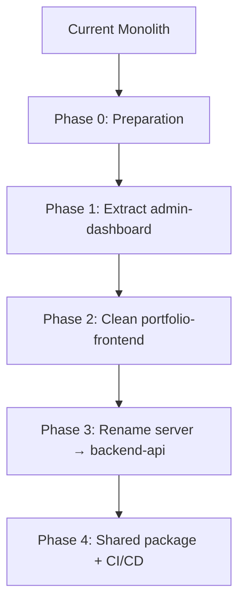

# Migration Roadmap — Monolith to Multi-Package Architecture

## Phase 0 — Preparation (Pre-Migration)



### Steps
1. **Create a new `git branch`** named `refactor/multi-package-architecture` to isolate all changes.
2. **Audit all imports** across `client/src/` to confirm every file's dependency.
3. **Copy `client/`** to a temporary folder as a safety backup.
4. **Install a fresh Vite + React scaffold** into a temporary location to compare configs.

---

## Phase 1 — Extract Admin Dashboard (from `client/` to `packages/admin-dashboard/`)

### Visual File Tree — After Phase 1

```
packages/admin-dashboard/
├── .env
├── index.html
├── vite.config.js
├── tailwind.config.js
├── postcss.config.js
├── eslint.config.js
├── package.json
├── vercel.json                  # (if deploying separately)
├── public/
│   └── favicon.svg
└── src/
    ├── main.jsx                 # NEW — standalone entry
    ├── App.jsx                  # NEW — admin-only router
    ├── index.css
    ├── pages/
    │   ├── Login.jsx            ← from client/src/pages/
    │   ├── Dashboard.jsx        ← from client/src/pages/
    │   ├── DashboardProjects.jsx← from client/src/pages/
    │   ├── Messages.jsx         ← from client/src/pages/
    │   └── dashboard/
    │       └── Analytics.jsx    ← from client/src/pages/dashboard/
    ├── layouts/
    │   └── DashboardLayout.jsx  ← from client/src/layouts/
    ├── components/
    │   ├── ProtectedRoute.jsx   ← from client/src/components/
    │   └── dashboard/           ← from client/src/components/dashboard/
    │       ├── AnalyticsStatCard.jsx
    │       ├── ChartCard.jsx
    │       ├── DashboardProjectCard.jsx
    │       ├── DashboardTable.jsx
    │       └── PageHeader.jsx
    ├── context/
    │   ├── ThemeContext.jsx     ← COPIED from client/src/context/
    │   └── ToastContext.jsx     ← from client/src/context/
    └── utils/
        ├── api.js               ← COPIED from client/src/utils/ (update URL)
        └── dashboardUtils.js    ← from client/src/utils/
```

### Files to Move (COPY then DELETE from client/ — Phase 2)

| Source (`client/src/...`) | Destination (`packages/admin-dashboard/src/...`) | Action |
|---|---|---|
| `pages/Login.jsx` | `pages/Login.jsx` | Move |
| `pages/Dashboard.jsx` | `pages/Dashboard.jsx` | Move |
| `pages/DashboardProjects.jsx` | `pages/DashboardProjects.jsx` | Move |
| `pages/Messages.jsx` | `pages/Messages.jsx` | Move |
| `pages/dashboard/Analytics.jsx` | `pages/dashboard/Analytics.jsx` | Move |
| `layouts/DashboardLayout.jsx` | `layouts/DashboardLayout.jsx` | Move |
| `components/ProtectedRoute.jsx` | `components/ProtectedRoute.jsx` | Move |
| `components/dashboard/*` | `components/dashboard/` | Move |
| `context/ToastContext.jsx` | `context/ToastContext.jsx` | Move |
| `utils/dashboardUtils.js` | `utils/dashboardUtils.js` | Move |
| `context/ThemeContext.jsx` | `context/ThemeContext.jsx` | Copy (portfolio also needs it) |
| `utils/api.js` | `utils/api.js` | Copy (portfolio also needs it) |

### Files to CREATE NEW

| File | Purpose |
|---|---|
| `packages/admin-dashboard/src/main.jsx` | Standalone React entry point — mounts admin `App` |
| `packages/admin-dashboard/src/App.jsx` | Admin-only router with `/login`, `/dashboard/*` routes |
| `packages/admin-dashboard/package.json` | Declares `react`, `react-dom`, `react-router-dom`, `lucide-react`, `recharts`, `axios`, etc. |
| `packages/admin-dashboard/vite.config.js` | Vite config for admin app (copied from client, adjust if needed) |
| `packages/admin-dashboard/tailwind.config.js` | Tailwind config (copied from client) |
| `packages/admin-dashboard/index.html` | HTML entry point |
| `packages/admin-dashboard/.env` | Admin-specific env vars (e.g., `VITE_API_URL`) |

### Why Each File Moves

| File | Why It Belongs in Admin Dashboard |
|---|---|
| `Login.jsx` | Admin authentication — not part of public portfolio |
| `Dashboard.jsx` | Admin-only overview with protected data |
| `DashboardProjects.jsx` | CRUD operations scoped to admin |
| `Messages.jsx` | Admin message inbox |
| `Analytics.jsx` | Admin analytics with protected data |
| `DashboardLayout.jsx` | Admin sidebar/nav — irrelevant to portfolio visitors |
| `ProtectedRoute.jsx` | Auth guard for admin routes only |
| `dashboard/*` | Stat cards, charts, tables — all admin-specific UI |
| `ToastContext.jsx` | Admin notification toasts |
| `dashboardUtils.js` | Helper functions used only by admin pages |

---

## Phase 2 — Clean Portfolio Frontend

After moving admin files, `client/src/` will have broken imports. This phase cleans it.

### Actions

1. **Rewrite `client/src/App.jsx`** — Remove all admin routes (`/login`, `/dashboard`, `/dashboard/*`). Keep only portfolio routes (`/` with `MainLayout` + `Home`).
2. **Delete admin-related imports** in `App.jsx`:
   - `DashboardLayout` (moved to admin)
   - `ProtectedRoute` (moved to admin)
   - `Login`, `Dashboard`, `DashboardProjects`, `Messages`, `Analytics` (moved to admin)
   - `ToastContext` (moved to admin)
3. **Delete `client/src/components/dashboard/`** — Entire folder is now in admin package.
4. **Delete `client/src/pages/Dashboard.jsx`**, `DashboardProjects.jsx`, `Messages.jsx`, `Login.jsx`, `pages/dashboard/` — All moved.
5. **Delete `client/src/layouts/DashboardLayout.jsx`** — Moved.
6. **Duplicate `api.js`** is kept in portfolio. Update its `VITE_API_URL` reference.
7. **Rename `client/` → `packages/portfolio-frontend/`** (optional).

### Visual File Tree — After Phase 2

```
packages/portfolio-frontend/        (was client/)
├── .env
├── index.html
├── vite.config.js
├── tailwind.config.js
├── postcss.config.js
├── eslint.config.js
├── vercel.json
├── package.json
└── src/
    ├── main.jsx
    ├── App.jsx                    # CLEANED — portfolio routes only
    ├── index.css
    ├── pages/
    │   └── Home.jsx
    ├── sections/
    │   ├── AboutSection.jsx
    │   ├── ContactSection.jsx
    │   ├── ExperienceSection.jsx
    │   ├── HeroSection.jsx
    │   ├── ProjectsSection.jsx
    │   ├── SkillsSection.jsx
    │   └── TerminalSection.jsx
    ├── components/
    │   ├── Navbar.jsx
    │   ├── Footer.jsx
    │   ├── ParticlesBackground.jsx
    │   ├── Loader.jsx
    │   ├── SocialLinks.jsx
    │   ├── ScrollToTop.jsx
    │   ├── ProjectCard.jsx
    │   ├── TestimonialCard.jsx
    │   ├── TestimonialsMarquee.jsx
    │   ├── AnimatedCounter.jsx
    │   ├── Terminal/
    │   │   └── (7 files)
    │   └── ui/
    │       ├── Button.jsx
    │       ├── Modal.jsx
    │       ├── FormInput.jsx
    │       ├── ConfirmationModal.jsx
    │       └── TimelineItem.jsx
    ├── layouts/
    │   └── MainLayout.jsx
    ├── context/
    │   ├── ThemeContext.jsx
    │   └── ProjectContext.jsx
    ├── hooks/
    │   ├── useTypewriter.js
    │   └── useVisitorTracking.js
    ├── utils/
    │   ├── api.js
    │   └── sectionNavigation.js
    ├── data/
    │   └── testimonials.js
    └── animations/
        └── variants.js
```

---

## Phase 3 — Rename server/ → backend-api/ (Optional)

### Actions
1. `git mv server backend-api`
2. Update any path references in Docker, CI/CD, or Procfile.
3. Update `package.json` `name` field.
4. The internal structure (`app.js`, `server.js`, `config/`, `controllers/`, etc.) stays unchanged.

**Why optional**: renaming is cosmetic. The server can stay as `server/` if preferred.

---

## Phase 4 — Optional Shared Package (`packages/shared-ui/`)

### Why Create It?
Both portfolio-frontend and admin-dashboard use the same small UI primitives:
- `Button.jsx`
- `Modal.jsx`
- `FormInput.jsx`
- `ConfirmationModal.jsx`
- `TimelineItem.jsx`

Without a shared package, these are duplicated across two apps.

### Structure
```
packages/shared-ui/
├── package.json          # name: @portfolio/shared-ui
├── src/
│   ├── Button.jsx
│   ├── Button.css        # (if not using Tailwind)
│   ├── Modal.jsx
│   ├── FormInput.jsx
│   ├── ConfirmationModal.jsx
│   └── TimelineItem.jsx
└── index.js              # Re-export all
```

### Integration
Both apps add to `package.json`:
```json
"dependencies": {
  "@portfolio/shared-ui": "workspace:*"
}
```

---

## Phase 5 — CI/CD & Deployment

### Current Deployment
- **Frontend** → Vercel (`client/` builds single app)
- **Backend** → Render.com (`server/`)

### Target Deployment
| App | Platform | Domain |
|---|---|---|
| `packages/portfolio-frontend` | Vercel | `portfolio.example.com` |
| `packages/admin-dashboard` | Vercel | `admin.portfolio.example.com` |
| `backend-api` | Render.com | `api.portfolio.example.com` |

### CORS Update
Update `server/app.js` `cors.origin` to include both frontend domains:
```js
origin: [
  'https://portfolio.example.com',
  'https://admin.portfolio.example.com',
  // dev origins
  'http://localhost:5173',
  'http://localhost:5174'
]
```

---

## Summary: Complete Migration Checklist

- [ ] Phase 0: Create git branch, audit imports, backup
- [ ] Phase 1:
  - [ ] Create `packages/admin-dashboard/` with own `package.json`, `vite.config.js`, `tailwind.config.js`
  - [ ] Copy `api.js` and `ThemeContext.jsx` into admin package
  - [ ] Move admin pages, layout, components, context, utils into admin package
  - [ ] Write new `main.jsx` and `App.jsx` for admin dashboard
  - [ ] Test admin dashboard runs standalone (`npm run dev` from admin dir)
- [ ] Phase 2:
  - [ ] Clean `client/src/App.jsx` — remove admin routes
  - [ ] Delete admin-only files from `client/`
  - [ ] Verify portfolio runs standalone without admin code
  - [ ] Rename `client/` → `packages/portfolio-frontend/` (optional)
- [ ] Phase 3:
  - [ ] Rename `server/` → `backend-api/` (optional)
  - [ ] Update deployment configs
- [ ] Phase 4:
  - [ ] Create `packages/shared-ui/` (optional)
  - [ ] Install shared package in both frontends
- [ ] Phase 5:
  - [ ] Update CORS in backend
  - [ ] Deploy admin-dashboard to Vercel (separate project)
  - [ ] Update portfolio-frontend Vercel project
  - [ ] Verify all routes and auth work end-to-end
- [ ] Cleanup:
  - [ ] Delete `admin-dashboard/` (root-level dead scaffold)
  - [ ] Delete any stale `node_modules` and reinstall per package
  - [ ] Update `.gitignore` if needed
  - [ ] Commit and merge branch

---

## Visual Tree — Final Target Structure

```
portfolio-cms/
│
├── packages/
│   ├── portfolio-frontend/        # Vite + React (public portfolio)
│   │   ├── src/
│   │   │   ├── main.jsx
│   │   │   ├── App.jsx
│   │   │   ├── pages/Home.jsx
│   │   │   ├── sections/          (7 files)
│   │   │   ├── components/
│   │   │   │   ├── Navbar.jsx, Footer.jsx, ...
│   │   │   │   ├── ui/            Button, Modal, FormInput, etc.
│   │   │   │   └── Terminal/      (8 files)
│   │   │   ├── layouts/MainLayout.jsx
│   │   │   ├── context/ThemeContext.jsx, ProjectContext.jsx
│   │   │   ├── hooks/             (2 files)
│   │   │   ├── utils/api.js, sectionNavigation.js
│   │   │   ├── data/testimonials.js
│   │   │   └── animations/variants.js
│   │   └── (config files)
│   │
│   ├── admin-dashboard/           # Vite + React (admin panel)
│   │   ├── src/
│   │   │   ├── main.jsx
│   │   │   ├── App.jsx
│   │   │   ├── pages/
│   │   │   │   ├── Login.jsx
│   │   │   │   ├── Dashboard.jsx
│   │   │   │   ├── DashboardProjects.jsx
│   │   │   │   ├── Messages.jsx
│   │   │   │   └── dashboard/Analytics.jsx
│   │   │   ├── components/
│   │   │   │   ├── dashboard/     (5 files)
│   │   │   │   └── ProtectedRoute.jsx
│   │   │   ├── layouts/DashboardLayout.jsx
│   │   │   ├── context/ThemeContext.jsx, ToastContext.jsx
│   │   │   └── utils/api.js, dashboardUtils.js
│   │   └── (config files)
│   │
│   └── shared-ui/                 # (optional) shared primitives
│       └── src/Button.jsx, Modal.jsx, ...
│
├── backend-api/                   # Express + MongoDB (was server/)
│   ├── app.js, server.js
│   ├── config/db.js, cloudinary.js
│   ├── controllers/               (7 files)
│   ├── middleware/authMiddleware.js, upload.js
│   ├── models/                    (5 files)
│   ├── routes/                    (7 files)
│   ├── services/googleAuthService.js
│   └── package.json
│
├── ARCHITECTURE_PLAN.md
├── MIGRATION_ROADMAP.md
├── .gitignore
└── README.md
```

---

## Dependency Graph (Final)

```
┌─────────────────────────┐     ┌─────────────────────────┐
│   portfolio-frontend    │     │     admin-dashboard     │
│  (packages/portfolio/)  │     │  (packages/admin/)      │
│                         │     │                         │
│  ┌───────────────────┐  │     │  ┌───────────────────┐  │
│  │   shared-ui/*     │  │     │  │   shared-ui/*     │  │
│  │   (Button, Modal, │  │     │  │   (Button, Modal, │  │
│  │    FormInput...)  │  │     │  │    FormInput...)  │  │
│  └────────┬──────────┘  │     │  └────────┬──────────┘  │
│           │             │     │           │             │
│  ┌────────▼──────────┐  │     │  ┌────────▼──────────┐  │
│  │     api.js        │  │     │  │     api.js        │  │
│  └────────┬──────────┘  │     │  └────────┬──────────┘  │
└───────────┼─────────────┘     └───────────┼─────────────┘
            │                               │
            │        HTTP / REST            │
            └───────────────┬───────────────┘
                            │
                    ┌───────▼────────┐
                    │   backend-api  │
                    │  (Express/Node)│
                    │               │
                    │  MongoDB      │
                    │  Cloudinary   │
                    │  Google OAuth │
                    └───────────────┘
```
